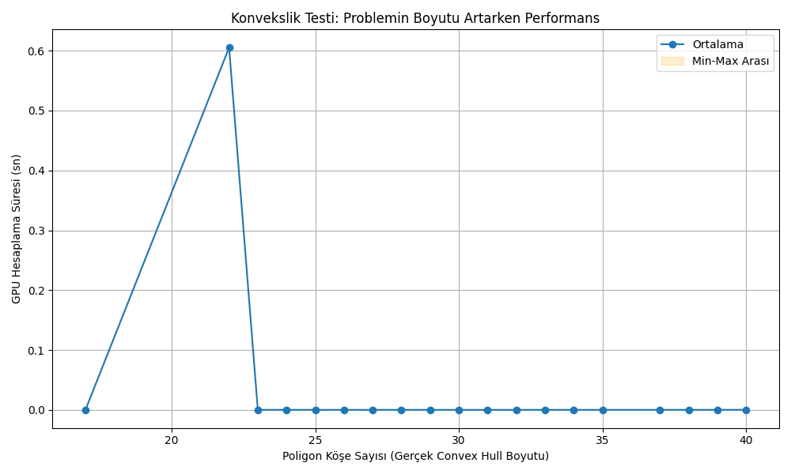
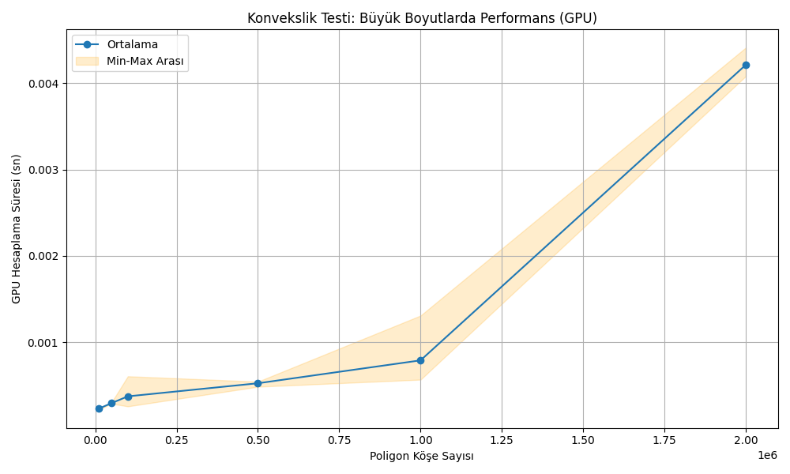
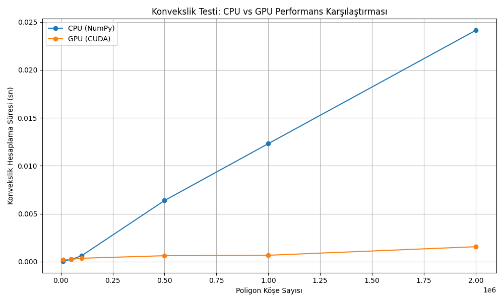

# Parallel Convexity Analysis Project

## Project Purpose

This project uses **parallel programming** techniques to determine whether a polygon, defined by given x and y coordinate arrays, is **convex**.  
Convexity analysis is performed using both classical thread/multiprocessing (CPU) and modern **CUDA-powered GPU acceleration**.

## Real-World Relevance

Convexity checking of polygons is critical in areas such as:
- **Computer vision** (object/shape detection)
- **Robotic path planning** (obstacle avoidance)
- **Geographic information systems** (map boundary analysis)
- **Data analytics** (determining convex hulls of data clusters)

## Algorithmic Principle

- The method uses the **cross product** of every consecutive triplet of vertices to determine the "turn direction" at each polygon corner.
- If all cross products have the same sign, the polygon is **convex**; otherwise, it is **concave**.

Mathematical formula:
```
Cross(A, B, C) = (x₂ - x₁) * (y₃ - y₂) - (y₂ - y₁) * (x₃ - x₂)
```

## Features

- **Thread/multiprocessing** for basic parallelization (CPU)
- **CUDA/Numba** for ultra-fast convexity testing on the GPU with thousands/millions of vertices
- Support for various polygon types: regular polygons, random convex hulls, and self-intersecting polygons
- **CPU-GPU comparative benchmarking** and automatic plot generation
- Comprehensive documentation and sample results

## Installation

1. Requires Python 3.8+
2. Install dependencies:
    ```bash
    pip install numpy matplotlib numba pandas scipy
    ```
3. (For GPU mode)
    - NVIDIA GPU with CUDA drivers installed
    - Compatible [CUDA Toolkit](https://developer.nvidia.com/cuda-downloads) and [Numba](https://numba.readthedocs.io/en/stable/cuda/index.html)

## Usage

```bash
python main.py
```

The script will prompt for parameters such as the number of vertices, polygon type, and level of parallelism.  
In **benchmark mode**, the program automatically runs performance tests and generates result plots.

## Sample Results

### GPU Usage for Small Inputs  
 
With small data, GPU is under-utilized and may show irregular timing spikes.

### GPU Performance for Large Inputs  
 
As the number of vertices increases, the GPU shows almost linear scaling; millions of vertices can be tested in seconds.

### CPU vs GPU Comparison  
_Figure 4_:  
Comparing CPU and GPU runtimes demonstrates that for large inputs, GPU is orders of magnitude faster.



## Academic & Scientific Contribution

- Fundamental convexity testing is parallelized on both CPU and GPU.
- Realistic and edge-case polygons (convex, concave, self-intersecting) are analyzed.
- Scientific graphics and benchmarking reveal the scalability and performance gains of parallel architectures.

## Video Presentation

For a full walkthrough with code, test cases, and graphical analysis:  
[YouTube Video Presentation]([https://www.youtube.com/](https://www.youtube.com/watch?v=q6JxeOT0JUc)  

## Contributing

Pull requests and suggestions are welcome!

## License

MIT

## References

- [Numba CUDA Documentation](https://numba.readthedocs.io/en/stable/cuda/index.html)
- [Python Threading Docs](https://docs.python.org/3/library/threading.html)
- [Scipy Convex Hull](https://docs.scipy.org/doc/scipy/reference/generated/scipy.spatial.ConvexHull.html)
- [CUDA Toolkit](https://developer.nvidia.com/cuda-downloads)
- [Matplotlib](https://matplotlib.org/)
